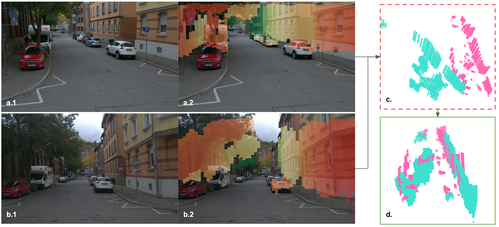

# SMORE-Camera-Perception
Small pipeline implementation of Stixel based Monocular Collective Perception for Autonomous Driving on the CoopScenes
dataset.
This repository provides the implementation for the monocular collective perception pipeline presented in the 
corresponding thesis and publication(s). The method enables spatial alignment and fusion of scene understanding between
infrastructure and vehicle-mounted **monocular cameras**, using a lightweight Stixel-based mid-level representation.

## 🚀 Overview

The pipeline includes:
- **StixelNExT++** inference models for infrastructure and vehicle views
- A **scan matching** module based on sparse Stixel Worlds
- Slanted Stixel correction for **camera elevation compensation**
- Tools for evaluation, visualization, and transformation matrix comparison

## 🧠 Method Summary

The approach relies on:
- Generating Stixel Worlds from monocular images via **StixelNExT++**
- Transforming each Stixel World into a global frame using camera extrinsics
- Performing **FPFH + RANSAC + ICP** scan matching to estimate the relative pose between agents
- Comparing the estimated transformation with dataset-provided ground truth

## 📈 Results
### Pipeline

### Samples

